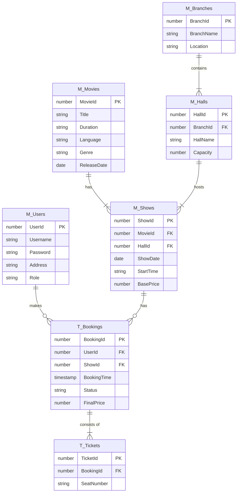

# Database ER Diagram (Conceptual)

This diagram represents the normalized 3NF schema I implemented. You can use this as a reference when building your model in **Oracle SQL Developer Data Modeler**.

## Why this design?

- **Normalization (3NF)**: By separating Branches, Halls, and Shows, we avoid data redundancy. For example, the Hall capacity is stored once, even if multiple different movies show in that hall.
- **Relational Integrity**: Foreign keys ensure that bookings cannot exist for non-existent users or shows.
- **Scalability**: This design allows KumariCinemas to easily add more branches or halls without changing the application logic.
